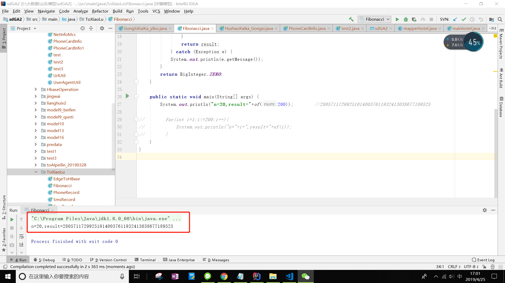

<h2>敏捷web开发作业_实现fibonacci数列</h2>

java代码：
```java
package test;

import java.math.BigInteger;

public class Fibonacci {
    /**
     * 实现 fibonacci 数列
     */
    public static BigInteger of(int num) {
        try {
            BigInteger firstNum = BigInteger.ONE;
            BigInteger secondNum = BigInteger.ZERO;
            BigInteger result = BigInteger.ZERO;
            for (int i = 0; i <num; i++) {
                    result = secondNum.add(firstNum);
                    firstNum = secondNum;
                    secondNum = result;
                }
                return result;
            } catch (Exception e) {
            System.out.println(e.getMessage());
        }
        return BigInteger.ZERO;
    }

    public static void main(String[] args) {
        System.out.println(of(200));        //280571172992510140037611932413038677189525

        for(int i=1;i<=200;i++){
            System.out.println("n="+i+",result="+of(i));
        }
    }
}
```

结果截图:
仅截图n=20的情况
</img>